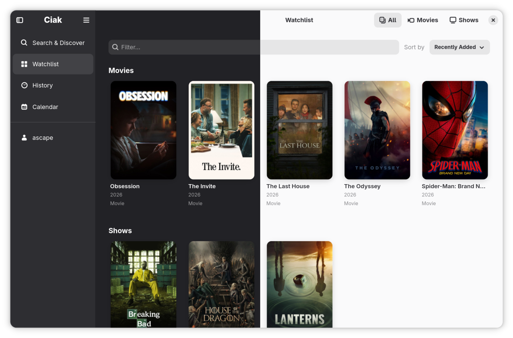
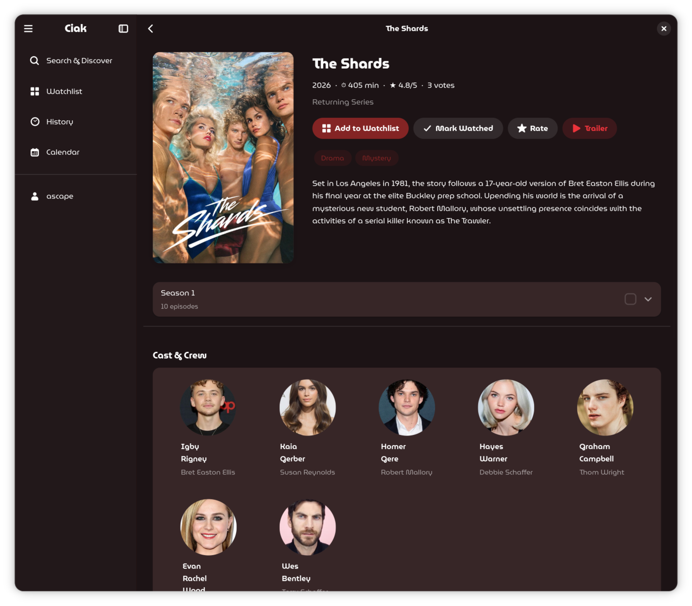
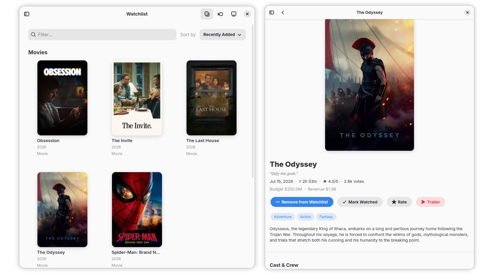
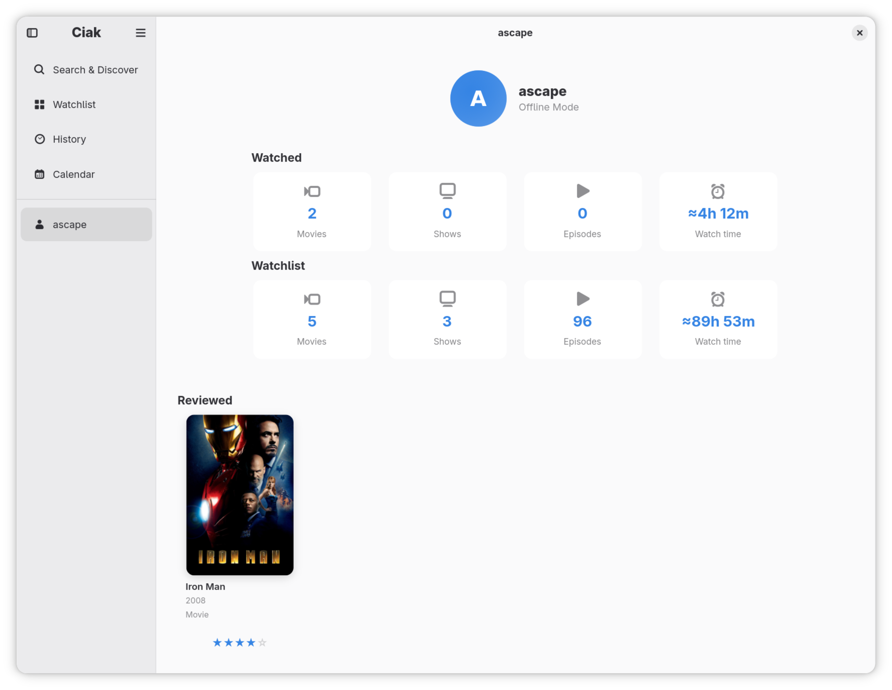
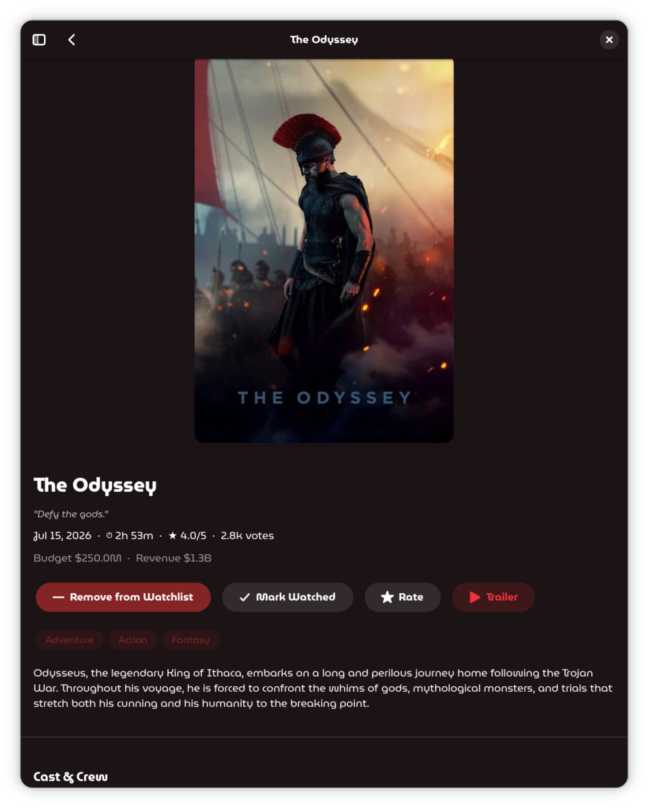
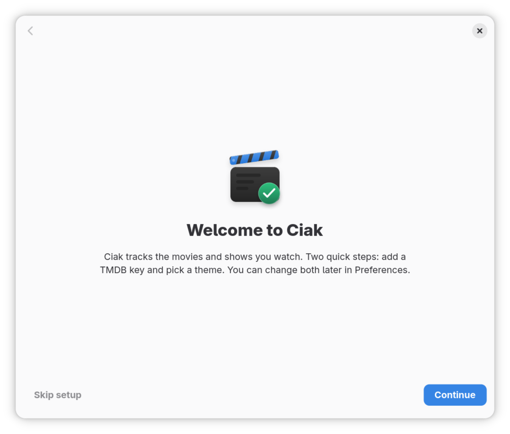

<p align="center"></p>

# Ciak

[](https://github.com/andrea-scape/ciak/actions)

Ciak keeps track of the movies and TV shows you watch on your Linux desktop.

The name comes from Italian film slang. When a director yells "Ciak!", the cameras roll. This app is about what you watch next.

## Screenshots

| Light & Dark | Detail |
|---|---|
|  |  |

| Responsive Layout | Stats |
|---|---|
|  |  |

| GNOME Theming | Easy Onboarding Setup |
|---|---|
|  |  |

## Getting started

Ciak is distributed as a Flatpak. On most Linux desktops that means one command, and it works like any other app.

### Install from the Ciak repository (recommended)

Add the repository once, then install:

```bash
flatpak remote-add --user ciak https://andrea-scape.github.io/ciak/ciak.flatpakrepo
flatpak install --user ciak io.github.andrea_scape.ciak
```

Updates arrive with a plain `flatpak update`.

### Or download the bundle

1. Download `ciak.flatpak` from the [latest release](https://github.com/andrea-scape/ciak/releases)
2. Install it:

```bash
flatpak install ./ciak.flatpak
```

Launch it from your app launcher, or run:

```bash
flatpak run io.github.andrea_scape.ciak
```

### First-run setup

Ciak pulls posters and details from The Movie Database, so it needs a free TMDB API key.

1. Get a key at [themoviedb.org/settings/api](https://www.themoviedb.org/settings/api)
2. Open **Preferences → TMDB** in the app
3. Paste your key

That's it. Search for a title and add it to your watchlist.

## Features

- Keep a watchlist of movies and shows, filter by type, sort by when you added them or when they came out
- Browse episodes season by season, mark what you've watched, see which ones air next
- Search the TMDB catalogue, movies and shows in separate tabs
- Calendar with the air dates of your watchlist shows
- Rate movies and shows from 1 to 5 stars
- Profile page with your watch time, watched counts and reviews
- Keyboard shortcuts for the main pages, each one toggleable in Preferences
- Dark and light theme, collapsible sidebar

Build a watchlist, mark episodes as seen, and get a heads-up when the next episode of your shows airs. Movie posters and details come from The Movie Database (TMDB). Your watchlist, history and ratings are stored on your own computer. Trakt sync planned for a future release.

## For developers

### Building the Flatpak

Development builds use the root manifest `io.github.andrea_scape.ciak.Devel.json`
(app-id `io.github.andrea_scape.ciak.Devel`, so posters decode without
glycin's sandbox). Requires `flatpak` and `org.flatpak.Builder` (or
`flatpak-builder`), plus the GNOME 50 SDK/runtime:

```bash
flatpak install org.gnome.Platform//50 org.gnome.Sdk//50
flatpak run org.flatpak.Builder --user --install \
  build-aux/flatpak/build \
  io.github.andrea_scape.ciak.Devel.json
flatpak run io.github.andrea_scape.ciak.Devel
```

Release builds use `build-aux/flatpak/io.github.andrea_scape.ciak.json`
(plain app-id, glycin sandbox enabled). The GitHub Actions workflow builds
that manifest and publishes it to the personal flatpak repository on GitHub
Pages.

Development builds show a blue "Development" pill (icon + label) at the bottom
of the sidebar; release builds don't.

### Project layout

```
src/                 # Python application (GTK4 / libadwaita)
  ui/                # Pages: watchlist, search, detail, calendar, profile…
  data/              # Local SQLite store + TMDB service/client + caching
  domain/            # Domain models (Movie, Show, Episode, Season…)
data/                # Flatpak metadata: desktop file, AppStream, GSettings schema, icon
io.github.andrea_scape.ciak.Devel.json   # Flatpak manifest (development build, .Devel)
build-aux/flatpak/   # Release manifest, GPG key, build directory
```

## Credits

- [GTK](https://www.gtk.org/) and [libadwaita](https://gnome.pages.gitlab.gnome.org/libadwaita/) for the toolkit
- [The Movie Database](https://www.themoviedb.org/) for metadata and poster images

## License

GPL-3.0-or-later. See [LICENSE](LICENSE).
